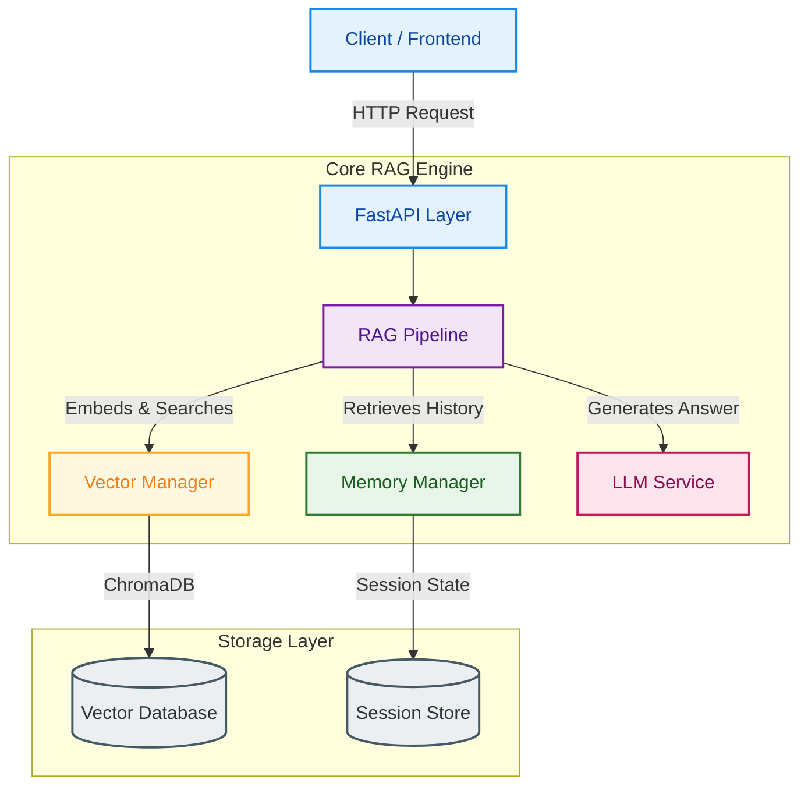
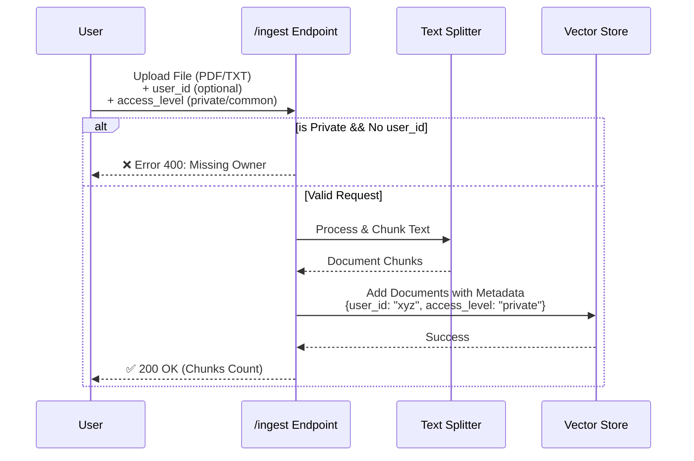
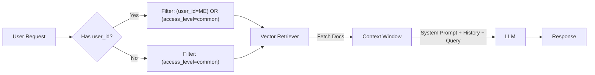

# TheUltimateRAG 🚀

**TheUltimateRAG** is a production-ready, modular, and highly flexible Retrieval-Augmented Generation (RAG) boilerplate. Built with **FastAPI**, **LangChain**, and **ChromaDB**, it is designed to be the robust foundation for your next AI application.

It goes beyond simple RAG, offering built-in **Multi-User Isolation**, **Organizational Data Support**, **Session Memory**, and **Advanced LLM Controls**.

---

## 🌟 Key Features

*   **⚡ FastAPI Powered**: High-performance, async-ready API.
*   **🧠 Intelligent Memory**: Session-based short-term memory with sliding window contexts.
*   **👥 Multi-User Support**: True data isolation. User A cannot access User B's private documents.
*   **🏢 Organizational Data**: Support for "Common" or "Public" knowledge base accessible by all users.
*   **🎛️ Advanced Controls**: Dynamic control over `temperature`, `max_tokens`, and System Prompts per request.
*   **🔍 Modular Vector Store**: ChromaDB integration with metadata filtering ($or queries) for security.
*   **🛡️ Robust Security**: Enforces ownership for private data ingestion.

---

## 🏗️ System Architecture

The system follows a clean, modular architecture separating the API layer, Core RAG logic, and storage services.



---

## 🔄 Workflows

### 1. Document Ingestion Flow
Data can be ingested as **Private** (User specific) or **Common** (Organization wide). The system automatically tags metadata for security.



### 2. RAG Retrieval & Generation Flow
When a user asks a question, the system intelligently filters data they are allowed to see (Their Data + Common Data).



---

## 🚀 Getting Started

### Prerequisites
*   Python 3.10+
*   OpenAI API Key

### Installation

1.  **Clone the repository**
    ```bash
    git clone https://github.com/Matrixxboy/TheUnltimateRAG.git
    cd TheUnltimateRAG
    ```

2.  **Install Dependencies**
    ```bash
    pip install -r requirements.txt
    ```

3.  **Configuration**
    Copy `.env.example` to `.env` and configure your settings:
    ```ini
    OPENAI_API_KEY=sk-proj-...
    APP_ENV=development
    MODEL_NAME=gpt-3.5-turbo
    VECTOR_DB_PATH=chroma_db
    MEMORY_WINDOW_SIZE=10
    ```

4.  **Run the Server**
    ```bash
    uvicorn app:app --reload
    ```
    Access Swagger Docs at: `http://localhost:8000/docs`

---

## 📡 API Endpoints

### 💬 Chat
`POST /api/v1/chat`

Advanced chat endpoint with full control.

**Payload:**
```json
{
  "query": "What is the company policy on remote work?",
  "session_id": "session_123",
  "user_id": "john_doe",     // Required for seeing your private data
  "temperature": 0.7,        // Optional: Creativity control
  "max_tokens": 500,         // Optional: Response length
  "system_prompt": "You are a helpful HR assistant." // Optional override
}
```

### 📥 Ingest
`POST /api/v1/ingest`

Upload files to the knowledge base.

*   `file`: The file to upload (PDF/TXT).
*   `access_level`: `"private"` (default) or `"common"`.
*   `user_id`: Required if `access_level` is "private".

### 🧠 Memory
`GET /api/v1/memory/{session_id}`
`DELETE /api/v1/memory/{session_id}`

View or clear the chat history for a specific session.

---

## 🔒 Security Model

The system uses a strictly enforceable metadata filtering strategy.

*   **Private Data**: Tagged with `user_id` AND `access_level="private"`. Can **ONLY** be retrieved if the query request includes the matching `user_id`.
*   **Common Data**: Tagged with `access_level="common"`. Can be retrieved by **ANY** user (or guest).
*   **Data Leakage Prevention**: The API layer validates input before it reaches the core logic, ensuring no "orphan" private documents exist.

---

## 📂 Project Structure

```
TheUltimateRAG/
├── API/                 # FastAPI Routes & Endpoints
│   └── v1/
│       └── endpoints/   # Chat, Ingest, Memory handlers
├── core/                # Core Application Logic
│   ├── rag_engine.py    # Main RAG Pipeline Orchestrator
│   ├── vector_store.py  # ChromaDB Manager & Security Filters
│   ├── memory.py        # Session History Manager
│   └── ingestion.py     # Document Loaders & Splitters
├── config/              # Configuration & Pydantic Configs
├── LLM/                 # LLM Connection Factory
├── Prompts/             # Prompt Management & Templates
└── tests/               # Verification Scripts
```

---
<center>

Made with ❤️ by [Matrixxboy](https://github.com/Matrixxboy)

</center>
